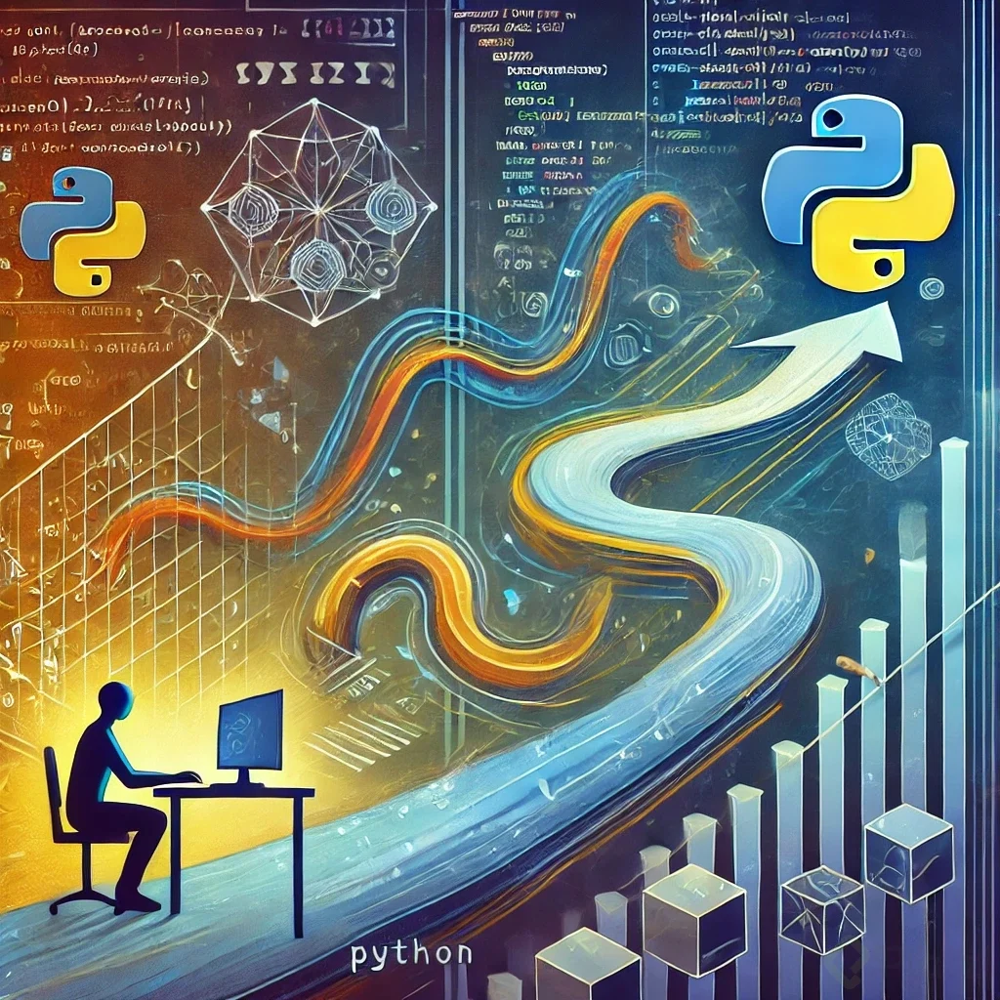

Recapitulación de lo aprendido hasta ahora

Hasta este punto, has recorrido los fundamentos de Python: su sintaxis, las estructuras de control, las funciones y el manejo básico de la biblioteca estándar. Estos conceptos son esenciales para cualquier programador y te han preparado para el siguiente paso en tu camino.

Motivación: La importancia de avanzar
Ahora, es momento de dar un paso más y enfrentar desafíos más complejos. Aprender a escribir código Pythonico y profesional no solo te permitirá resolver problemas de una manera más eficiente y limpia, sino que te abrirá la puerta a proyectos más ambiciosos y demandantes.

En esta nueva etapa, es crucial contar con conocimientos sólidos sobre:

Programación orientada a objetos (POO): cómo estructurar mejor tu código, creando clases y objetos que sean reutilizables y fáciles de entender.
Manejo avanzado de excepciones: cómo gestionar errores de forma elegante y robusta.
Decoradores y generadores: formas avanzadas de controlar el flujo de tu código y maximizar la eficiencia.
Módulos y paquetes: cómo organizar y estructurar grandes proyectos de forma profesional.
Escritura de código eficiente y legible: técnicas para escribir código que no solo funcione, sino que sea mantenible y optimizado.
El Proyecto: El no negociable
La mejor manera de consolidar estos nuevos conocimientos es aplicarlos en un proyecto práctico. Esta sección final te guiará en el desarrollo de un proyecto completo, donde aplicarás lo aprendido en esta sección avanzada.

El proyecto será la herramienta clave que te permitirá interiorizar estos conceptos. A través de él, aprenderás no solo a resolver problemas complejos, sino a pensar como un desarrollador profesional. Recuerda: la teoría es importante, pero solo se convierte en aprendizaje real cuando la pones en práctica. Este proyecto es el “no negociable”: es lo que te hará aprender o aprender.

¿Qué podrás hacer con estos nuevos conocimientos?
Al completar este módulo y el proyecto, serás capaz de:

Escribir código Python eficiente, limpio y estructurado.
Resolver problemas complejos con un enfoque orientado a objetos.
Utilizar módulos y paquetes para crear proyectos escalables.
Manejar excepciones y errores de forma profesional, asegurando que tu código sea robusto.
Trabajar en proyectos reales aplicando las mejores prácticas de la industria.
Conclusión: El camino hacia la maestría
Este es un paso crucial en tu carrera como desarrollador. Con este nuevo nivel de comprensión, estarás preparado para abordar cualquier desafío que Python te presente y crear proyectos que impacten en el mundo real. ¡Es momento de avanzar, aprender y construir!